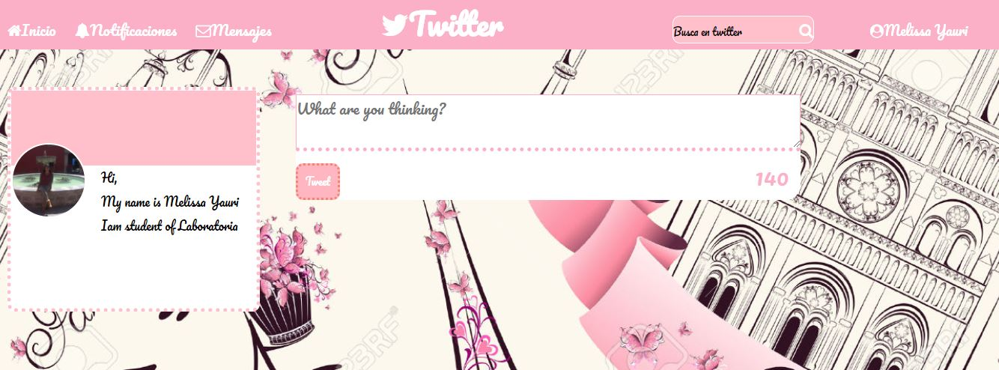

# Reto de código: twitter

## Autor
Melissa Yauri
***

## Objetivo
Replicar el newsfeed de Twitter.

El cual está compuesto por una serie de versiones, las cuales son:

* Versión 0.0.1
Diseñar un formulario que permita ingresar un texto y un botón para "twittear".Agregar un evento de click al botón o de submit al formulario.En el evento, obtener el texto.
Agregar el texto al HTML.

* Versión 0.0.2
No ingresar texto vacío (deshabilitar el botón de "twittear").Contar la cantidad de caracteres de forma regresiva.

* Versión 0.0.3
Si pasa los 140 caracteres, deshabilitar el botón.
Si pasa los 120 caracteres, mostrar el contador con OTRO color.
Si pasa los 130 caracteres, mostrar el contador con OTRO color.
Si pasa los 140 caracteres, mostrar el contador en negativo.

* Versión 0.0.4
Al presionar enter(/n) que crezca el textarea de acuerdo al tamaño del texto.

* Versión 0.0.5 (Extra)
Si la cantidad de caracteres ingresados (sin dar un enter), supera al tamaño del textarea por defecto, debe de agregarse una línea más para que no aparezca el scroll. (Si en caso aplica).

* Versión 0.0.6 (Extra)
Agregar la hora en que se publicó el tweet. En el formato de 24 horas: hh:mm.

## Herramientas utilizadas
* css
* HTML
* Javascript
